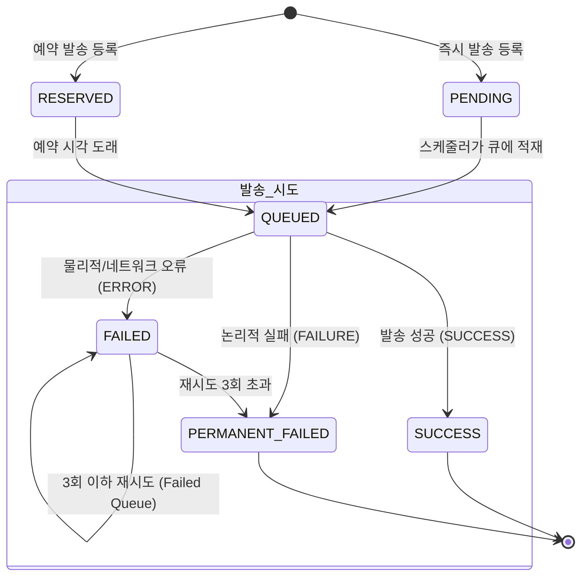
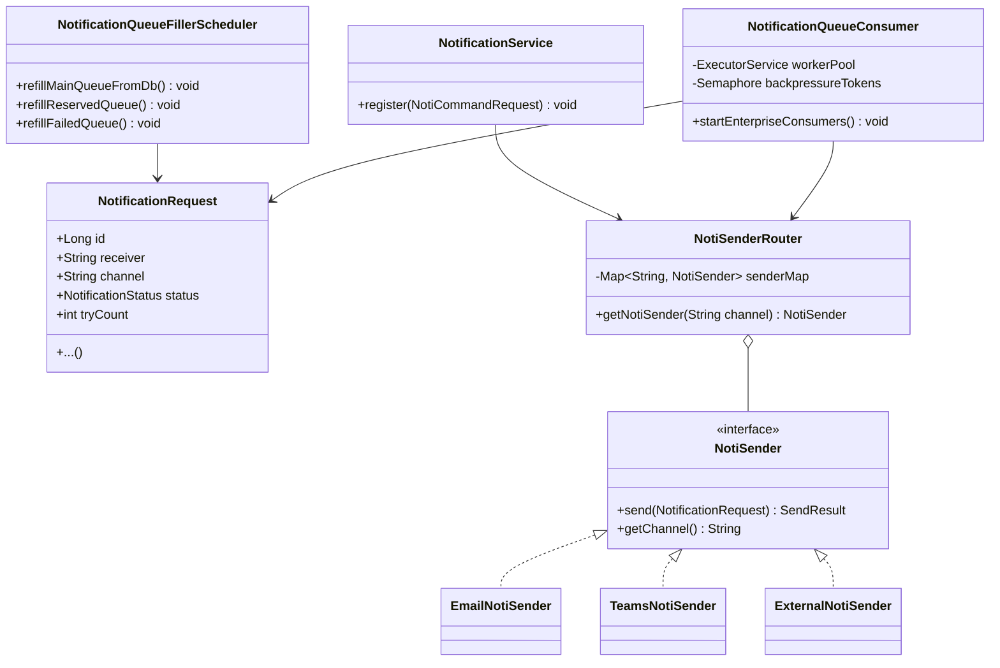

# Notification Middleware

> Spring Boot + In-Memory Queue로 구현한 비동기 알림 발송 미들웨어.
> 요청 수용 / 큐 기반 비동기 발송 / 재시도 전략 / 채널 추상화까지 직접 설계하고,
> k6 부하 테스트로 단계적으로 구조를 개선했습니다.

---

## 목차

1. [프로젝트 목적과 흐름](#1-프로젝트-목적과-흐름)
2. [시스템 개요](#2-시스템-개요)
3. [알림 상태 흐름](#3-알림-상태-흐름)
4. [핵심 설계 결정](#4-핵심-설계-결정)
5. [적용 패턴](#5-적용-패턴)
6. [클래스 다이어그램](#6-클래스-다이어그램)
7. [부하 테스트 진행 과정](#7-부하-테스트-진행-과정)
8. [최종 컨슈머 구조](#8-최종-컨슈머-구조)
9. [설계 트레이드오프 및 한계](#9-설계-트레이드오프-및-한계)
10. [실행 방법](#10-실행-방법)

---

## 1. 프로젝트 목적과 흐름

처음에는 알림 미들웨어 시스템을 직접 만들면서 멀티스레드, Virtual Threads, Non-blocking I/O 같은 개념을 공부해보며 대용량 트래픽을 처리하는 시스템을 경험해보려 했습니다.

하지만 실제 상용 알림 API(Teams 등)의 환경을 확인해보니, 외부 연동 API에는 엄격한 처리량 제한과 응답 지연이 존재했습니다. 이를 현실적으로 시뮬레이션하기 위해 평균 응답 4초, 최대 처리량이 50 TPS로 제한된 Mock 서버를 구성하고 부하 테스트를 진행했습니다.

막상 테스트를 해보니 스레드 모델을 바꿔도 외부 서버의 물리적 한계(50 TPS)를 넘을 수 없다고 판단했습니다. 그래서 핵심 질문과 방향이 바뀌었습니다.

> "어떻게 하면 더 빠르게?"가 아니라
> **"미들웨어가 자원낭비 없이 안정적으로 외부 서버의 처리 한계를 온전히 뽑아낼 수 있는가?"**

총 4개의 방식과 테스트를 거쳐 마지막에는 미들웨어가 발송 API 서버의 처리 한계를 1% 오차 내외로 뽑아낼 수 있었습니다. 스레드 모델 공부도 됐지만, **단일 서버 미들웨어에서 병목이 어디서 생기는지를 수치로 직접 확인하고 튜닝해 나가는 과정**이 되었습니다.

---

## 2. 시스템 개요

본 미들웨어는 클라이언트의 알림 요청을 빠르게 수용하고, 지연이 발생하는 외부 API로의 실제 발송은 비동기로 처리하여 시스템 간의 결합도를 낮추고 처리량을 극대화하도록 설계했습니다.

### 시스템 아키텍쳐

flowchart LR
    Client([클라이언트]) -->|1. 발송 요청| API

    subgraph Middleware [내가 구축한 영역 : Notification Middleware]
        direction LR
        
        subgraph Layer1 [Layer 1: API 수용]
            API[POST /regist] -->|2. 저장 후 즉시 200 OK| DB[(Database)]
        end
        
        Scheduler{Queue Filler Scheduler}
        DB -.->|3. 주기적 DB 폴링| Scheduler
        
        subgraph Layer2 [Layer 2: 비동기 발송 파이프라인]
            direction LR
            
            subgraph Queues [3-Queue System]
                MainQ[(Main)]
                ResvQ[(Reserved)]
                FailQ[(Failed)]
            end
            
            Scheduler -->|적재| MainQ
            Scheduler -->|적재| ResvQ
            Scheduler -->|적재| FailQ
            
            Pool[공유 워커 풀 200 - PriorityBlockingQueue]
            Router{NotiSender Router}
            
            MainQ -->|4. 우선순위 1| Pool
            ResvQ -->|우선순위 2| Pool
            FailQ -->|우선순위 3| Pool
            
            Pool -->|5. 전략 라우팅| Router
            
            Router --> Email[Email]
            Router --> Teams[Teams]
            Router --> Ext[Ext]
        end
    end

    Email --> MockServer
    Teams --> MockServer
    Ext --> MockServer([외부 API Server - Max: 50 TPS])

    %% 미들웨어 영역을 돋보이게 하는 스타일링 (파란색 굵은 점선 테두리)
    style Middleware fill:#f8f9fa,stroke:#0d6efd,stroke-width:3px,stroke-dasharray: 5 5

**핵심 원칙 설정**: API 수용 계층과 발송 계층을 분리합니다.
API는 DB 저장만 하고 즉시 200을 반환하며, 실제 발송은 비동기 컨슈머가 독립적으로 처리합니다.

---

## 3. 알림 상태 흐름

알림 데이터는 목적과 발송 결과에 따라 명확한 생명주기를 가집니다.



| 상태 | 의미 |
| --- | --- |
| **PENDING** | DB 저장 완료, 즉시 발송을 위해 큐 대기 중 |
| **RESERVED** | 지정된 예약 시각까지 대기 중 |
| **QUEUED** | 메모리 큐에 적재되어 컨슈머가 처리 중인 상태 |
| **SUCCESS** | 외부 API 발송 완료 (최종 상태) |
| **FAILED** | 타임아웃 등 일시적 실패 (재시도 대상) |
| **PERMANENT_FAILED** | 최종 실패 (수신자 오류 등 논리적 오류 or 재시도 한계 도달) |

---

## 4. 핵심 설계 결정

### 왜 외부 MQ 대신 In-Memory Queue와 DB Polling인가?

프로젝트 및 공부를 진행하며 최종 병목 구간은 **최대 처리량이 50 TPS로 고정된 외부 발송 API(Mock)**라고 판단했습니다.

지금 제약 사항에서 대용량 트래픽 처리에 특화된 Kafka 등 메시지 브로커를 도입하는 것은 **오버엔지니어링**이라고 판단했습니다. 미들웨어 구간의 처리 능력을 아무리 높이더라도, 최종 발송 측의 물리적 한계를 넘을 수 없기 때문입니다.

따라서 본 프로젝트에서는 단일 서버 환경에서 자바 내장 PriorityBlockingQueue와 DB 커서 폴링만으로 외부 서버의 한계치(50 TPS)를 최대한 끌어내고 병목을 제어하는 것에 집중했습니다.

_추후 외부 서버의 성능 한계가 매우 높거나 무제한이라는 가정하에, 대규모 트래픽 수용과 다중 인스턴스(Scale-out) 환경에서의 분산 처리를 위한 MQ(ex.Kafka) 도입은 후속 프로젝트로 실험하고 학습할 예정입니다._

### 3-Queue 비동기 파이프라인

| 큐 | 대상 | Refill 주기 | 용량 |
| --- | --- | --- | --- |
| Main Queue | PENDING 알림 (즉시 발송) | 1초 | 100 |
| Reserved Queue | RESERVED 알림 (예약 발송) | 5초 | 100 |
| Failed Queue | FAILED 알림 (재시도) | 5초 | 100 |

refill 주기와 용량을 위와 같이 설정한 이유는 각 테스트를 진행하며 적어놨습니다.  
간단하게 요약하자면 각 Queue 컨수머의 처리량보다 공급량이 많도록 계산 후에 적용한 결과입니다.

_추가로 메모리 효율을 위해 큐에는 **엔티티 전체가 아닌 ID만 저장**하며, 발송 시점에 DB에서 최신 상태를 re-fetch합니다._

### SendResult로 재시도 전략 분리

HTTP 상태 코드가 200이더라도 비즈니스 로직에 따라 결과를 세분화했습니다.

* `SUCCESS`: 발송 성공 → 완료 처리
* `FAILURE`: 논리적 실패 (수신자 차단, 잘못된 형식 등) → 재시도 없이 즉시 `PERMANENT_FAILED`
* `ERROR`: 물리적 실패 (타임아웃, 5xx) → `Failed Queue` 이동 후 최대 3회 재시도

### Cursor 기반 DB 폴링

```java
// OFFSET 방식 대신 id 커서 사용
repo.findTop100ByStatusAndIdGreaterThanOrderByIdAsc(PENDING, lastProcessedId);
```

고부하 상황에서 `createdAt` (타임스탬프) 기반 폴링은 동일 시간대 레코드의 영구 누락을 유발할 수 있고, OFFSET 방식은 중복 처리가 발생할 수 있어 **Auto-increment PK인 id를 커서로 사용**해 안정성을 확보했습니다.

### AtomicBoolean으로 스케줄러 중복 실행 방지

```java
if (!isMainSchRunning.compareAndSet(false, true)) return;
try {
    refillMainQueueFromDb();
} finally {
    isMainSchRunning.set(false);
}

```
---

## 5. 적용 패턴

* **전략 패턴 (Strategy) - 발송 채널:** 채널(Email, Teams 등)이 추가되어도 `NotiSender` 인터페이스 구현체만 추가하면 됩니다. 기존 코드는 수정에 닫혀 있습니다.
* **레지스트리 패턴 (Registry):** Spring의 의존성 주입을 활용해 `NotiSenderRouter`에 채널 구현체들을 Map 형태로 자동 등록하여 if-else 분기를 제거했습니다.
    ```java
    public NotiSenderRouter(List<NotiSender> senders) {
        senders.forEach(s -> senderMap.put(s.getChannel().toUpperCase(), s));
    }
    ```
* **프로듀서-컨슈머 패턴:** API 수용과 발송을 분리하여, 외부 서버 장애나 지연이 우리 서버의 API 응답 속도에 영향을 주지 않는 Back-pressure 구조를 만들었습니다.
* **CQRS (패키지 수준 분리):** 등록/발송 커맨드와 이력 조회 쿼리를 패키지 단위로 분리하여, 향후 읽기 트래픽 증가 시 별도의 최적화가 가능하도록 구조를 잡았습니다.

## 6. 클래스 다이어그램



---

## 7. 부하 테스트 진행 과정

mock 서버 스펙: 평균 응답 4초 / 최대 동시 처리 200 VU(톰캣 기본설정) / SUCCESS·FAILURE·ERROR 각 33% 발생되도록 설정

| 단계 | 변경 내용 | 처리량(TPS) | 결과 및 판단 |
| --- | --- | --- | --- |
| **Test 1** | 단일 스레드 컨슈머 | 0.27건/s | 기준선(Baseline) 확인 |
| **Test 2** | 고정 스레드 풀 120/20/60 | 28.4건/s | mock 서버 처리량의 ~81% 활용. 성능 105배 상승 |
| **Test 3** | HTTP 타임아웃 6초 추가 | 22.55건/s | 타임아웃으로 재시도가 증가하며 처리량 하락. **고정 스레드 배분의 한계(유휴 스레드 발생) 발견** |
| **Test 4** | 공유 우선순위 워커 풀 200 | 27.3건/s | **mock 서버 이론 처리량(50 TPS)의 ~99% 활용 달성** |

**Test 3에서 발견한 고정 배분의 구조적 한계:**
타임아웃 도입 후 실패 큐 유입이 늘었을 때, Main용 120개 스레드는 자신의 큐가 소진된 이후 유휴 상태로 낭비되었습니다. 런타임에 변하는 유입 비율을 고정 스레드 풀로는 대응할 수 없음을 데이터로 확인했습니다.

**Test 4에서 구조를 바꾼 이유:**
200개의 스레드를 하나의 공유 풀로 묶어, 메인 큐가 비면 자연스럽게 실패 큐 처리로 스레드가 투입되도록 설계했습니다. 내부적으로 `PriorityBlockingQueue`를 사용하여 작업의 우선순위를 보장했습니다.

자세한 수치와 쿼리 결과는 각 테스트 README에서 확인할 수 있습니다.

| 테스트 | 상세 |
|--------|------|
| Test 1 - Baseline | [README](k6/test1_baseline/README.md) |
| Test 2 - Multi Thread | [README](k6/test2_multithread/README.md) |
| Test 3 - Timeout | [README](k6/test3_timeout/README.md) |
| Test 4 - Priority Worker Pool | [README](k6/test4_priority_worker/README.md) |

---

## 8. 최종 컨슈머 구조

```java
// 200 스레드 공유 워커 풀 + 우선순위 내부 대기열
this.workerPool = new ThreadPoolExecutor(
    200, 200, 0L, MILLISECONDS,
    new PriorityBlockingQueue<Runnable>()
);

// 디스패처 3개: take()로 이벤트 기반 대기, 세마포어 획득 후 워커 풀에 투입
startPriorityDispatcher(mainQueue,     priority=1); // Main
startPriorityDispatcher(reservedQueue, priority=2); // Reserved
startPriorityDispatcher(failedQueue,   priority=3); // Failed

// Back-pressure용 세마포어: 워커 200 + 대기열 버퍼 100 = 300 토큰 제한
// 300 초과 시 디스패처가 스스로 대기
private final Semaphore backpressureTokens = new Semaphore(300);

```

**최종 테스트 결과:**

* 총 mock API 호출: **27,168건**
* 이론상 최소 완료시간: 27,168 ÷ 50 TPS = **543초**
* 실측 완료시간: **549초 (오차 1.1%)**

미들웨어 자체가 병목이 되지 않고 외부 서버의 처리 한계까지 성능을 끌어올렸습니다. 이 한계 도달점에서는 Virtual Threads나 Non-blocking I/O를 도입해도 Mock 서버(50 TPS)의 제약 때문에 성능이 오르지 않을것이라 판단하고 **공유 워커 풀 + 우선순위 내부 대기렬**로 튜닝을 완료했습니다.

---


## 9. 설계 트레이드오프 및 한계

**① 컨슈머 DB 재조회 부하 (Memory vs DB I/O)**
큐에 ID만 저장하여 OOM을 방지하고 최신 상태를 보장하지만, 컨슈머가 발송 시점마다 DB에서 Re-fetch를 수행해야 합니다. 처리량이 극단적으로 높아지면 DB의 Read 처리가 새로운 병목이 될 수 있을것 같습니다.

**② 재시도 간격 부재**
`FAILED` 상태가 되면 다음 스케줄러 사이클(5초)에 바로 큐에 재삽입됩니다. 외부 API 서버가 심각한 장애 상태일 때 불필요한 요청이 쏟아질 수 있으므로, 향후 Exponential Backoff(지수적 백오프) 전략 도입이 필요할 것 같습니다.

**③ Scale-out 시의 한계**
스케줄러 중복 방지를 JVM 메모리 기반의 `AtomicBoolean`으로 처리했습니다. 서버가 2대 이상으로 스케일 아웃될 경우 여러 인스턴스가 동일한 DB 레코드를 동시에 가져가 중복 발송될 위험이 있습니다. 확장이 필요해지는 시점에는 외부 MQ(Kafka 등) 도입으로 아키텍처 전환이 필요할 것 같습니다.

**④ ★ Starvation 가능성**
`PriorityBlockingQueue`내부에서 worker가 태스크를 꺼낼 때 항상 우선순위가 높은 태스크를 먼저 선택하므로, main 큐가 지속적으로 유입되는 극단적인 상황에서 failed 태스크가 PBQ 안에 계속 쌓이기만 하고 실행되지 못하는 Starvation이 발생할 수 있습니다.

---
## 10. 실행 방법

**요구사항**
* Java 17+
* Gradle 8.x

```bash
# 서버 시작(Mac 기준 이며 Windows는 gradlew.bat로 실행)
./gradlew bootRun
```

**접속 정보**

* **Swagger UI:** `http://localhost:8080/swagger-ui/index.html`
* **H2 Console:** `http://localhost:8080/h2-console`
    * JDBC URL: `jdbc:h2:mem:testdb`
    * ID: `sa` / Password: (빈값)


### API 사용 예시

```bash
# 1. 즉시 발송 등록
curl -X POST http://localhost:8080/notifications/regist \
  -H "Content-Type: application/json" \
  -d '{"receiver":"user@example.com","channel":"TEAMS","title":"제목","content":"내용"}'

# 2. 예약 발송 등록
curl -X POST http://localhost:8080/notifications/regist \
  -H "Content-Type: application/json" \
  -d '{"receiver":"user@example.com","channel":"TEAMS","title":"제목","content":"내용","reservedAt":"2026-12-01T09:00:00"}'

# 3. 발송 이력 조회
curl "http://localhost:8080/notifications/history?receiver=user@example.com&month=1&page=0&size=20"
```