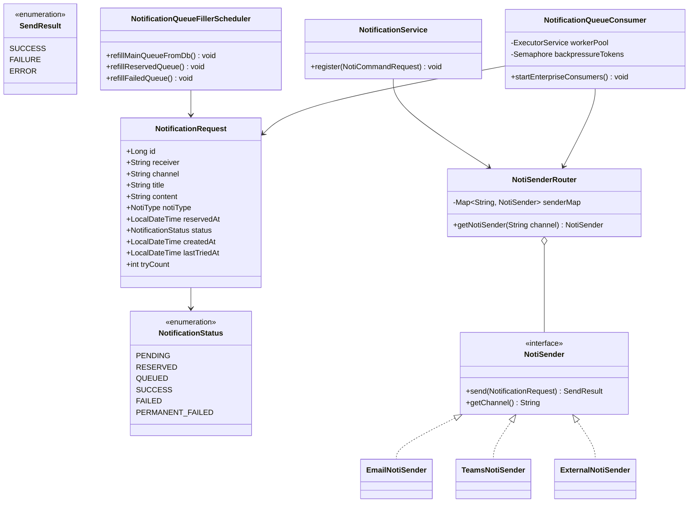

# Notification Middleware

> Spring Boot + In-Memory Queue로 구현한 비동기 알림 발송 미들웨어.
> 요청 수용 / 큐 기반 비동기 발송 / 재시도 전략 / 채널 추상화까지 직접 설계하고,
> k6 부하 테스트로 단계적으로 구조를 개선했습니다.

---

## 목차

1. [프로젝트 목적과 흐름](#1-프로젝트-목적과-흐름)
2. [시스템 개요](#2-시스템-개요)
3. [핵심 설계 결정](#3-핵심-설계-결정)
4. [적용 패턴](#4-적용-패턴)
5. [클래스 다이어그램](#5-클래스-다이어그램)
6. [상태 흐름](#6-상태-흐름)
7. [부하 테스트 진행 과정](#7-부하-테스트-진행-과정)
8. [최종 컨슈머 구조](#8-최종-컨슈머-구조)
9. [설계 트레이드오프 및 한계](#9-설계-트레이드오프-및-한계)
10. [실행 방법](#10-실행-방법)

---

## 1. 프로젝트 목적과 흐름

처음에는 알림 시스템을 직접 만들면서 멀티스레드, Virtual Threads, Non-blocking I/O 같은 개념을 체득해보려는 목적으로 시작했습니다.

그런데 막상 부하 테스트를 진행하면서 예상과 다른 방향으로 흘러갔습니다.
외부 발송 서버(mock)의 처리 한계가 **50 TPS**로 고정되어 있어서,
스레드 모델을 아무리 바꿔도 그 한계를 넘을 수 없었습니다.
결국 핵심 질문이 바뀌었습니다.

> "어떻게 하면 더 빠르게?"가 아니라
> **"미들웨어가 외부 서버의 처리 한계를 온전히 뽑아낼 수 있는가?"**

4번의 테스트를 거쳐 마지막에는 이론값(543초) 대비 실측값(549초) 오차 1.1%까지 도달했습니다.
스레드 모델 공부보다는, 단일 서버 미들웨어에서 병목이 어디서 생기는지를 수치로 직접 확인하는 과정이 됐습니다.

---

## 2. 시스템 개요

```
┌─────────────────────────────────────────────────────────────────┐
│                        Layer 1 - API 수용                        │
│   POST /notifications/regist  →  DB 저장 (즉시 200 반환)          │
└──────────────────────────────┬──────────────────────────────────┘
                               │
┌──────────────────────────────▼──────────────────────────────────┐
│                        Layer 2 - 비동기 발송                      │
│                                                                  │
│   ┌──────────────┐    ┌─────────────────┐    ┌───────────────┐  │
│   │  Main Queue  │    │  Reserved Queue │    │  Failed Queue │  │
│   │  (cap: 1000) │    │  (cap: 1000)    │    │  (cap: 500)   │  │
│   └──────┬───────┘    └────────┬────────┘    └───────┬───────┘  │
│          └────────────────────┼─────────────────────┘           │
│                                │                                  │
│                    ┌───────────▼───────────┐                     │
│                    │  공유 워커 풀 (200)    │                     │
│                    │  PriorityBlockingQueue │                     │
│                    └───────────┬───────────┘                     │
│                                │                                  │
│                    ┌───────────▼───────────┐                     │
│                    │   NotiSenderRouter    │                     │
│                    │  (채널별 전략 라우팅)  │                     │
│                    └───────────┬───────────┘                     │
│              ┌─────────────────┼──────────────────┐             │
│              ▼                 ▼                  ▼             │
│        EmailSender       TeamsSender       ExternalSender        │
│              └─────────────────┼──────────────────┘             │
│                                ▼                                  │
│                         외부 발송 API Server                      │
└─────────────────────────────────────────────────────────────────┘
```

**핵심 원칙**: API 수용 계층과 발송 계층을 분리합니다.
API는 DB 저장만 하고 즉시 200을 반환하며, 실제 발송은 비동기 컨슈머가 독립적으로 처리합니다.

---

## 3. 핵심 설계 결정

### 3-Queue 비동기 파이프라인

| 큐 | 대상 | Refill 주기 | 용량 |
|----|------|------------|------|
| Main Queue | PENDING 알림 (즉시 발송) | 1초 | 1000 |
| Reserved Queue | RESERVED 알림 (예약 발송) | 5초 | 1000 |
| Failed Queue | FAILED 알림 (재시도) | 5초 | 500 |

큐에는 **엔티티 전체가 아닌 ID만 저장**합니다. 메모리를 최소화하고, 발송 시점에 DB에서 최신 상태를 re-fetch합니다.

### SendResult로 재시도 전략 분리

```java
public enum SendResult {
    SUCCESS,   // 발송 성공 → PERMANENT 종료
    FAILURE,   // 논리적 실패 (수신자 차단, 잘못된 형식 등) → 재시도 없이 PERMANENT_FAILED
    ERROR      // 물리적 실패 (타임아웃, 5xx) → failedQueue 이동, 최대 3회 재시도
}
```

HTTP 200이더라도 응답 body의 status 필드로 SUCCESS/FAILURE를 구분하고,
HTTP 4xx/5xx 또는 네트워크 예외는 ERROR로 처리합니다.
잘못된 수신자처럼 재시도해도 결과가 같은 케이스는 바로 PERMANENT_FAILED로 확정합니다.

### Cursor 기반 DB 폴링

```java
// OFFSET 방식 대신 id 커서 사용
repo.findTop100ByStatusAndIdGreaterThanOrderByIdAsc(PENDING, lastProcessedId);
```

OFFSET 방식은 폴링 사이에 새 레코드가 삽입되면 skip/중복이 발생할 수 있습니다.
`createdAt` 커서는 고부하 시 동일 타임스탬프 충돌로 배치 경계의 레코드를 영구 누락시킬 수 있어
auto-increment PK인 id를 커서로 사용했습니다.

### AtomicBoolean으로 스케줄러 중복 실행 방지

```java
if (!isMainSchRunning.compareAndSet(false, true)) return;
try {
    refillMainQueueFromDb();
} finally {
    isMainSchRunning.set(false);
}
```

---

## 4. 적용 패턴

### 전략 패턴 - 발송 채널

```
NotiSender (interface)
    ├── EmailNotiSender
    ├── TeamsNotiSender
    └── ExternalNotiSender
```

채널 추가 = `NotiSender` 구현 클래스 하나 추가. Router와 기존 Sender는 수정하지 않습니다.

### 레지스트리 패턴 - NotiSenderRouter

```java
public NotiSenderRouter(List<NotiSender> senders) {
    senders.forEach(s -> senderMap.put(s.getChannel().toUpperCase(), s));
}
```

Spring이 빈 목록을 주입할 때 자동으로 채널이 등록됩니다. if-else 없이 N개 채널을 지원합니다.

### 프로듀서-컨슈머 패턴

API 수용 속도와 외부 발송 서버 처리 속도를 큐로 분리합니다.
외부 서버 지연이 API 응답에 영향을 주지 않으며, 큐가 꽉 차면 스케줄러가 자연스럽게 대기하는 Back-pressure 구조가 됩니다.

### CQRS (패키지 수준)

커맨드(등록/발송)와 쿼리(조회)를 패키지 단위로 분리했습니다.
현재는 같은 DB를 사용하지만, 향후 읽기 성능 최적화가 필요할 때 쿼리 측만 수정할 수 있는 구조로 판단했습니다.

---

## 5. 클래스 다이어그램



---

## 6. 상태 흐름

```
        등록 (즉시)          등록 (예약)
            │                    │
            ▼                    ▼
       PENDING              RESERVED
            │                    │
 스케줄러가 큐에 넣을 때    예약 시각 도래 + 스케줄러
            │                    │
            ▼                    ▼
         QUEUED              QUEUED
            │
    컨슈머가 발송 시도
            │
┌───────────┼───────────┐
│           │           │
SUCCESS   FAILURE     ERROR
│           │           │
▼           ▼           ▼
SUCCESS  PERMANENT_  FAILED ──(3회 초과)──► PERMANENT_FAILED
         FAILED         │
                        └──(3회 이내)──► failedQueue → 재시도
```

| 상태 | 의미 |
|------|------|
| PENDING | DB 저장 완료, 큐 대기 중 |
| RESERVED | 예약 시각까지 대기 중 |
| QUEUED | 큐에 적재됨, 컨슈머 처리 중 |
| SUCCESS | 발송 완료 (최종) |
| FAILED | 일시적 실패, 재시도 대상 |
| PERMANENT_FAILED | 최종 실패 (논리 오류 or 재시도 한계 도달) |

---

## 7. 부하 테스트 진행 과정

mock 서버 스펙: 평균 응답 4초 / 최대 동시 처리 200 VU / SUCCESS·FAILURE·ERROR 각 33%

| 단계 | 변경 내용 | 결과 | 판단 |
|------|---------|------|------|
| **Test 1** | 단일 스레드 컨슈머 | 0.27건/s | 기준선 확인 |
| **Test 2** | 고정 스레드 풀 120/20/60 | 28.4건/s (105배↑) | mock 서버 처리량의 ~81% 활용 |
| **Test 3** | 타임아웃 6초 추가 | 22.55건/s (오히려 하락) | 타임아웃 → 재시도 증가 → 총 호출량 증가 → 전체 시간 늘어남 |
| **Test 4** | 공유 우선순위 워커 풀 200 | 27.3건/s | mock 서버 이론 처리량의 ~99% 활용 |

**Test 3에서 발견한 고정 배분의 구조적 한계:**

타임아웃 도입 후 실패 큐 유입이 늘었을 때, Main 120 스레드는 큐가 소진된 이후 유휴 상태로 전환됐습니다.
처리량이 정확히 절반으로 꺾이는 현상이 타임라인 데이터로 확인됐습니다.
스레드 배분 비율을 아무리 조정해도 런타임의 변하는 유입 비율을 사전에 맞출 수 없고 실제로는 매번 바뀔것으로 판단했습니다.

**Test 4에서 구조를 바꾼 이유:**

고정 배분 대신 200 스레드를 하나의 공유 풀로 운영하면,
메인 큐가 소진되는 순간 별도 전환 없이 실패 큐 처리로 자연스럽게 이어집니다.
`PriorityBlockingQueue`를 내부 대기열로 사용해 메인 큐 작업이 실패 큐보다 먼저 실행되도록 했습니다.

자세한 수치와 쿼리 결과는 각 테스트 README에서 확인할 수 있습니다.

| 테스트 | 상세 |
|--------|------|
| Test 1 - Baseline | [README](k6/test1_baseline/README.md) |
| Test 2 - Multi Thread | [README](k6/test2_multithread/README.md) |
| Test 3 - Timeout | [README](k6/test3_timeout/README.md) |
| Test 4 - Priority Worker Pool | [README](k6/test4_priority_worker/README.md) |

---

## 8. 최종 컨슈머 구조

```java
// 200 스레드 공유 워커 풀 + 우선순위 내부 대기열
this.workerPool = new ThreadPoolExecutor(
    200, 200, 0L, MILLISECONDS,
    new PriorityBlockingQueue<Runnable>()
);

// 디스패처 3개: take()로 이벤트 기반 대기, 세마포어 획득 후 워커 풀에 투입
startPriorityDispatcher(mainQueue,     priority=1); // Main
startPriorityDispatcher(reservedQueue, priority=2); // Reserved
startPriorityDispatcher(failedQueue,   priority=3); // Failed

// 배압 세마포어: 워커 200 + 버퍼 100 = 300 토큰
// 300 초과 시 디스패처가 스스로 대기 → OOM 방지
private final Semaphore backpressureTokens = new Semaphore(300);
```

**최종 결과:**

```
총 mock API 호출: 27,168건
이론 완료시간  : 27,168 ÷ 50 TPS = 543초
실측 완료시간  : 549초  (오차 1.1%)
```

미들웨어 자체가 병목이 되지 않고 외부 서버 처리 한계에 근접한 처리량을 뽑아낸 것으로 판단됩니다.
이 구조에서 Virtual Threads나 Non-blocking I/O로 전환해도 외부 서버(50 TPS) 한계는 바뀌지 않으므로,
단일 서버 미들웨어로서 개선 방향은 여기까지라고 봤습니다.

---

## 9. 설계 트레이드오프 및 한계

**① 컨슈머가 큐에서 ID를 꺼낼 때 DB 재조회**

큐에 ID만 저장해 메모리를 최소화하고 발송 시점에 최신 상태를 보장하는 방향을 선택했습니다.
그 대가로 컨슈머가 발송 시점마다 DB에서 re-fetch합니다. 처리량이 높아질수록 DB read 부하가 커질 수 있습니다.

**② 재시도 간격 없음**

FAILED 상태가 되면 다음 스케줄러 사이클(5초)에 바로 재삽입됩니다.
외부 서버가 장애 상태일 때 불필요한 요청이 계속 나갈 수 있습니다.
Exponential Backoff 같은 지연 재시도 전략으로 개선할 수 있으나 이번 구현에는 포함하지 않았습니다.

**③ AtomicBoolean은 단일 인스턴스에서만 유효**

스케줄러 중복 실행 방지를 JVM 내 AtomicBoolean으로 처리했습니다.
인스턴스가 2개 이상으로 수평 확장되면 동일 레코드를 여러 인스턴스가 동시에 처리할 수 있습니다.
이 경우 Kafka 같은 외부 MQ로 전환이 필요한 지점으로 판단됩니다.

**④ 세마포어 단계에서의 우선순위 미보장**

PriorityBlockingQueue의 우선순위는 워커 풀 내부에서만 작동합니다.
세마포어 획득 경쟁에서는 Main/Failed 디스패처가 동등하게 경쟁하므로,
이론적으로 Failed 디스패처가 토큰을 연속 선점하면 Main 작업이 진입을 못 하는 상황이 발생할 수 있습니다.

---

## 10. 실행 방법

```bash
# 서버 시작
./gradlew bootRun

# Swagger UI
http://localhost:8080/swagger-ui/index.html

# H2 Console
http://localhost:8080/h2-console
JDBC URL : jdbc:h2:mem:testdb
ID       : sa
Password : (빈값)
```

### API 예시

```bash
# 즉시 발송
curl -X POST http://localhost:8080/notifications/regist \
  -H "Content-Type: application/json" \
  -d '{"receiver":"user@example.com","channel":"TEAMS","title":"제목","content":"내용"}'

# 예약 발송
curl -X POST http://localhost:8080/notifications/regist \
  -H "Content-Type: application/json" \
  -d '{"receiver":"user@example.com","channel":"TEAMS","title":"제목","content":"내용","reservedAt":"2026-12-01T09:00:00"}'

# 발송 이력 조회
curl "http://localhost:8080/notifications/history?receiver=user@example.com&month=1&page=0&size=20"
```
