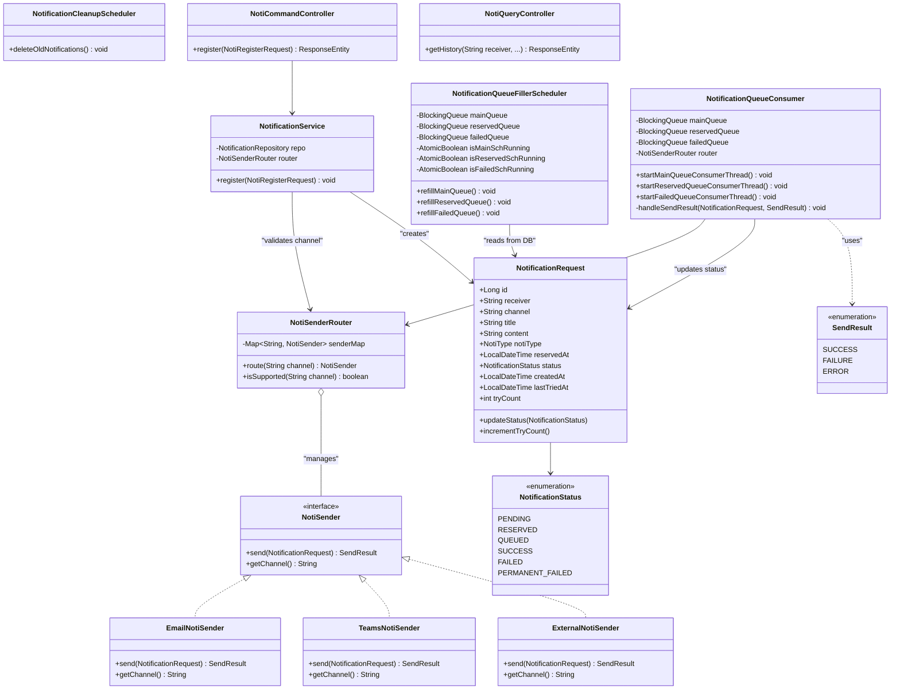

# Notification Middleware

> 알림 시스템을 직접 설계·구현하며 대용량 트래픽 처리 구조를 체득하는 것을 목표로 만든 미들웨어.
> 단순한 알람 API 발송이 아니라, 요청 흐름 통제 / 발송 채널 추상화 / 재시도 전략까지 구현해 봤습니다.

---

## 목차

1. [프로젝트 목적](#1-프로젝트-목적)
2. [시스템 개요](#2-시스템-개요)
3. [아키텍처 및 주요 설계 결정](#3-아키텍처-및-주요-설계-결정)
4. [적용 패턴과 그 이유](#4-적용-패턴과-그-이유)
5. [클래스 다이어그램](#5-클래스-다이어그램)
6. [상태 흐름](#6-상태-흐름)
7. [설계 트레이드오프 및 현재 한계](#7-설계-트레이드오프-및-현재-한계)
8. [주요 설계 포인트](#8-주요-설계-포인트)
9. [부하 테스트](#9-부하-테스트)
10. [실행 방법](#10-실행-방법)

---

## 1. 프로젝트 목적

알림 시스템은 대부분의 서비스에서 존재하지만, 내부 동작을 제대로 이해하고 만들어본 경험은 없었습니다
이 프로젝트는 아래 호기심들을 해소하고자 시작했습니다.

- 수십만 건의 알림 요청이 동시에 들어오면 어떻게 처리해야 하는가?
- 외부 발송 서버가 느릴 때, 시스템 전체가 멈추지 않으려면 어떤 구조가 필요한가?
- 발송 실패를 어떻게 감지하고, 어떤 기준으로 재시도하거나 포기하는가?
- 발송 채널(Email, Teams 등)이 늘어날 때 코드를 최소한으로 수정하려면?

Spring Boot + JPA + In-Memory Queue로 구현하고, k6 부하 테스트로 직접 수치를 확인하며 개선해갈 예정입니다.

---

## 2. 시스템 개요

```
┌─────────────────────────────────────────────────────────────────┐
│                        Layer 1 - API 수용                        │
│   POST /notifications/regist  →  DB 저장 (즉시 200 반환)          │
└──────────────────────────────┬──────────────────────────────────┘
                               │
┌──────────────────────────────▼──────────────────────────────────┐
│                        Layer 2 - 비동기 발송                      │
│                                                                  │
│   ┌──────────────┐    ┌─────────────────┐    ┌───────────────┐  │
│   │  Main Queue  │    │  Reserved Queue │    │  Failed Queue │  │
│   │  (cap: 1000) │    │  (cap: 1000)    │    │  (cap: 500)   │  │
│   └──────┬───────┘    └────────┬────────┘    └───────┬───────┘  │
│          │                    │                      │           │
│   ┌──────▼───────┐    ┌───────▼─────────┐    ┌──────▼────────┐  │
│   │ Main Consumer│    │Reserved Consumer│    │Failed Consumer│  │
│   └──────┬───────┘    └────────┬────────┘    └───────┬───────┘  │
│          └──────────────────── ┼ ─────────────────────┘          │
│                                │                                  │
│                                ▼                                  │
│                    ┌───────────────────────┐                     │
│                    │   NotiSenderRouter    │                     │
│                    │ (채널별 전략 라우팅)    │                     │
│                    └───────────┬───────────┘                     │
│                                │                                  │
│              ┌─────────────────┼──────────────────┐             │
│              ▼                 ▼                  ▼             │
│        EmailSender       TeamsSender       ExternalSender        │
│              └─────────────────┼──────────────────┘             │
│                                ▼                                  │
│                         Mock API Server                          │
└─────────────────────────────────────────────────────────────────┘
```

**핵심 원칙**: API 요청 받는 계층과 발송 계층을 분리합니다.
API는 DB 저장만 진행하며, 실제 발송은 비동기 컨슈머가 독립적으로 처리

---

## 3. 아키텍처 및 주요 설계 결정

### 패키지 구조 (CQRS 기반)

```
com.ym.noti
├── command/             # 쓰기: 알림 등록, 큐 처리, 발송
│   ├── config/          # Queue / Scheduler / RestTemplate Bean 정의
│   ├── controller/      # POST 엔드포인트
│   ├── service/         # 비즈니스 로직 + 컨슈머
│   ├── domain/          # NotificationRequest (JPA Entity), 상태 Enum
│   ├── dto/             # 요청/응답 DTO
│   ├── data/            # 쓰기용 Repository
│   └── router/          # 채널 라우팅 + Sender 구현체
│       └── sender/
├── query/               # 읽기: 알림 이력 조회
│   ├── controller/      # GET 엔드포인트
│   ├── data/            # 읽기 전용 Repository
│   └── dto/
└── exception/           # GlobalExceptionHandler
```

### 3-Queue 비동기 파이프라인

| 큐 | 대상 | Refill 주기 | 용량 |
|----|------|------------|------|
| Main Queue | PENDING 알림 (즉시 발송) | 1초 | 1000 |
| Reserved Queue | RESERVED 알림 (예약 발송) | 5초 | 1000 |
| Failed Queue | FAILED 알림 (재시도) | 5초 | 500 |

큐에는 **엔티티 전체가 아닌 ID만 저장**. 메모리 사용을 최소화하고, 실제 발송 시점에 최신 상태를 DB에서 re-fetch

### SendResult로 재시도 전략 분리

```java
public enum SendResult {
    SUCCESS,   // 발송 성공 → PERMANENT 종료
    FAILURE,   // 논리적 실패 (수신자 차단, 잘못된 형식 등) → 재시도 없이 PERMANENT_FAILED
    ERROR      // 물리적 실패 (타임아웃, 5xx) → failedQueue 이동, 최대 3회 재시도
}
```

HTTP 200이더라도 응답 body의 status 필드로 SUCCESS/FAILURE를 구분하고,
HTTP 4xx/5xx 또는 네트워크 예외는 ERROR로 처리

이 구분이 중요한 이유: 잘못된 수신자에게는 재시도해봤자 의미없고, 서버 장애로 인한 실패는 나중에 다시 시도

### Cursor 기반 DB 폴링

```java
// OFFSET 방식 대신 id 커서 사용
lastProcessedId = lastEnqueuedEntity.getId();
repo.findTop100ByStatusAndIdGreaterThanOrderByIdAsc(PENDING, lastProcessedId);
```

OFFSET 방식은 중간에 새 레코드가 삽입되면 skip/중복이 발생 가능. id 커서를 이용하면 이 문제를 회피할 수 있다.
`createdAt` 커서는 초당 수백 건의 요청이 몰릴 때 배치 경계에서 동일 타임스탬프가 발생할 수 있어
`createdAt > cursor` 조건이 일부 건을 영구적으로 누락시킬 수 있다. id는 auto-increment PK라 항상 unique하므로 이 문제가 없다.

### 컨슈머 스레드 풀 크기 결정 전략

mock 서버 부하 테스트로 최대 동시 처리 가능한 VU를 **200**으로 확인했습니다.
3개 큐의 스레드 합산이 200을 초과하면 mock 서버를 초과 부하하므로, 총 유입량 비율로 배분했습니다.

```
ERROR 발생 시 최대 3회 재시도 → 실패 큐 총 유입량:
  N/3 + N/9 + N/27 = 13N/27 ≈ 0.48N

Main : Failed 비율 = N : 13N/27 = 27 : 13
```

| 큐 | 스레드 수 | 근거 |
|----|---------|------|
| Main | **120** | 200 × 27/40 |
| Reserved | **20** | Main에서 여유분 확보 |
| Failed | **60** | 200 × 13/40 |
| **합산** | **200** | mock 서버 최대 동시 처리 한도 |

### AtomicBoolean으로 스케줄러 중복 실행 방지

```java
private final AtomicBoolean isMainSchRunning = new AtomicBoolean(false);

if (!isMainSchRunning.compareAndSet(false, true)) return; // 이미 실행 중이면 skip
try {
    refillMainQueueFromDb();
} finally {
    isMainSchRunning.set(false);
}
```

---

## 4. 적용 패턴과 그 이유

### 전략 패턴 (Strategy Pattern) - 발송 채널

```
NotiSender (interface)
    ├── EmailNotiSender
    ├── TeamsNotiSender
    └── ExternalNotiSender
```

**이유**: 채널별 발송 로직은 독립적으로 변경됩니다. 전략 패턴을 쓰면 새 채널 추가 시 Router와 기존 Sender를 전혀 수정하지 않아도 됩니다.

**장점**: OCP(개방-폐쇄 원칙) 충족. 채널 추가 = 클래스 하나 추가.

### 레지스트리 패턴 (Registry/Factory) - NotiSenderRouter

```java
// 생성자 주입 시점에 모든 NotiSender 구현체를 자동 등록
public NotiSenderRouter(List<NotiSender> senders) {
    senders.forEach(s -> senderMap.put(s.getChannel().toUpperCase(), s));
}
```

**이유**: 라우터가 채널 이름으로 Sender를 찾아야 하는데, if-else나 switch 대신 Map으로 관리하면 N개 채널이 생겨도 라우터 코드는 변경 불필요.

**장점**: ConcurrentHashMap 사용으로 멀티스레드 환경에서도 안전.

### 프로듀서-컨슈머 패턴

```
NotificationQueueFillerScheduler (Producer)
    └─ DB → BlockingQueue

NotificationQueueConsumer (Consumer)
    └─ BlockingQueue → 외부 API
```

**이유**: API 요청 수용 속도와 외부 발송 서버 처리 속도(초당 수 건) 간 속도 차이를 방어가 가능합니다. 두 계층을 완전히 디커플링해서 외부 서버 지연이 API 응답에 영향을 주지 않도록 했습니다.

**장점**: Back-pressure 자연 구현 (큐가 꽉 차면 DB에만 저장되고 대기).

**단점**: 큐 크기 초과 시 데이터가 큐가 아닌 DB에만 머무르다가 다음 스케줄러 사이클에 처리됨. 즉각성이 필요한 알림에서는 약간의 지연 발생 가능.

### CQRS (패키지 수준)

커맨드(등록/발송)와 쿼리(조회)를 패키지 단위로 분리했습니다. 현재는 같은 DB를 사용하지만, 향후 읽기 성능 최적화(읽기 전용 DB, 캐시 레이어 등)로 확장할 때 구조 변경 없이 쿼리 측만 수정할 수 있을것으로 판단됩니다.

---

## 5. 클래스 다이어그램



---

## 6. 상태 흐름

```
                등록 (즉시)          등록 (예약)
                    │                    │
                    ▼                    ▼
               PENDING              RESERVED
                    │                    │
         스케줄러가 큐에 넣을 때       예약 시각 도래 + 스케줄러
                    │                    │
                    ▼                    ▼
                 QUEUED              QUEUED
                    │
            컨슈머가 발송 시도
                    │
        ┌───────────┼───────────┐
        │           │           │
   SendResult   SendResult  SendResult
    SUCCESS      FAILURE      ERROR
        │           │           │
        ▼           ▼           ▼
     SUCCESS  PERMANENT_    FAILED ──(3회 초과)──► PERMANENT_FAILED
              FAILED             │
                                 └──(3회 이내)──► failedQueue → 재시도
```

| 상태 | 의미 |
|------|------|
| PENDING | DB 저장 완료, 큐 대기 중 |
| RESERVED | 예약 시각까지 대기 중 |
| QUEUED | 큐에 적재됨, 컨슈머 처리 중 |
| SUCCESS | 발송 완료 (최종) |
| FAILED | 일시적 실패, 재시도 대상 |
| PERMANENT_FAILED | 최종 실패 (논리 오류 or 재시도 한계 도달) |

---

## 7. 설계 트레이드오프 및 현재 한계

지금까지의 구현을 바탕으로 현재 구조의 한계를 정리했습니다.

**① 컨슈머가 큐에서 ID를 꺼낼 때 DB 재조회**

메모리 효율과 알람 최신버전 사용(ex 캔슬될 가능성)위해 큐에 ID만 저장하는 구조를 선택했습니다. 그 대가로 컨슈머가 실제 발송 시점에 DB에서 엔티티를 re-fetch합니다. 처리량이 높아지면 DB read 부하로 이어질 수 있습니다.

**② 재시도 간격 없음**

FAILED 상태가 되면 다음 스케줄러 사이클(5초)에 바로 재삽입됩니다.지연 없이 재시도하는 구조라 외부 서버가 장애 상태일 때 불필요한 요청이 발생할 수 있습니다.

**③ AtomicBoolean은 단일 인스턴스에서만 유효**

스케줄러 중복 실행 방지를 JVM 내 AtomicBoolean으로 처리했습니다. 인스턴스가 2개 이상으로 수평 확장되면 동일 레코드를 여러 인스턴스가 동시에 처리할 수 있으며 이 경우를 위한 다른 방법 (MQ를 kafka같은 솔루션 사용) 등으로 처리해볼까 합니다.

---

## 8. 주요 설계 포인트

**API 수용 속도와 발송 처리 속도를 분리해서 측정**

이 시스템의 성능 지표는 두 가지입니다. k6로 측정되는 API TPS는 Layer 1(DB write 속도)이고, 실제 알림 처리량은 Layer 2(컨슈머 Throughput)입니다. 두 지표를 혼동하면 병목 원인을 잘못 짚게 됩니다. 부하 테스트에서 이 둘을 의도적으로 분리해서 측정했습니다.

**재시도 전략**

외부 알람 발송API의 응답 status 필드 SUCCESS / FAILURE(논리 실패) / ERROR(물리 실패)를 구분해 재시도 여부를 결정합니다. 수신자 차단이나 잘못된 형식처럼 재시도해도 결과가 같은 케이스는 즉시 PERMANENT_FAILED로 처리합니다.

**고정 크기 큐 + DB 폴링으로 자연스러운 Back-pressure**

큐 용량을 고정하면 외부 발송 서버에 가해지는 동시 요청 수를 제어할 수 있습니다. 큐가 꽉 차면 스케줄러가 DB에서 더 가져오지 않고 대기합니다. 별도의 rate limiter 없이 큐 용량 자체가 흐름 제어 역할을 합니다.

**Cursor 기반 DB 폴링**

LIMIT/OFFSET 방식은 폴링 사이 새 레코드가 삽입되면 레코드를 건너뛸 수 있습니다. id 커서를 이용해 마지막으로 처리한 id 이후만 조회하는 방식으로 이 문제를 회피했습니다. `createdAt` 커서는 고부하 시 동일 타임스탬프 충돌로 배치 경계에 걸린 레코드를 영구 누락시킬 수 있어 auto-increment PK인 id를 커서로 사용합니다.

**전략 패턴으로 채널 확장 유지보수성 확보**

NotiSender 인터페이스를 구현하는 클래스를 추가하는 것만으로 새 발송 채널이 등록됩니다. Router도, 기존 Sender도 수정하지 않습니다. Spring이 빈 목록을 주입할 때 자동으로 senderMap에 등록됩니다.

---

## 9. 부하 테스트

k6를 이용해 단계적으로 병목을 진단합니다.

| 테스트 | 목적 | 상세 |
|--------|------|------|
| Test 1 - Baseline | 단일 스레드 컨슈머의 한계 측정 | [README](k6/test1_baseline/README.md) |
| Test 2 - Multi Thread | 스레드 풀 확장 후 처리량 개선 측정 | [README](k6/test2_multithread/README.md) |
| Test 3 - Timeout | 외부 서버 지연 시 타임아웃 유무 효과 비교 | [README](k6/test3_timeout/README.md) |

---

## 10. 실행 방법

```bash
# 서버 시작
./gradlew bootRun

# Swagger UI
http://localhost:8080/swagger-ui/index.html

# H2 Console (DB 직접 확인)
http://localhost:8080/h2-console
JDBC URL : jdbc:h2:mem:testdb
ID       : sa
Password : (빈값)
```

### API 예시

```bash
# 즉시 발송
curl -X POST http://localhost:8080/notifications/regist \
  -H "Content-Type: application/json" \
  -d '{"receiver":"user@example.com","channel":"TEAMS","title":"제목","content":"내용"}'

# 예약 발송
curl -X POST http://localhost:8080/notifications/regist \
  -H "Content-Type: application/json" \
  -d '{"receiver":"user@example.com","channel":"TEAMS","title":"제목","content":"내용","reservedAt":"2026-12-01T09:00:00"}'

# 발송 이력 조회
curl "http://localhost:8080/notifications/history?receiver=user@example.com&month=1&page=0&size=20"
```
