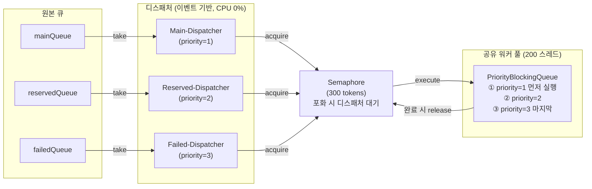

# Test 4 - 우선순위 워커 풀

## 목적

고정 스레드 배분 방식(Test 2/3: Main 120 / Reserved 20 / Failed 60)의 핵심 한계를 해결합니다.

Test 3에서 확인한 문제:
- 타임아웃 도입 후 실패 큐 유입량이 급증해도 Failed 스레드는 60개로 고정
- 메인 큐가 소진된 순간, 120개 Main 스레드가 할 일 없이 유휴 상태로 전환
- 처리량이 정확히 절반으로 꺾이는 구조적 낭비 발생
- 스레드 배분 비율을 바꿔도 유입 비율이 런타임에 변하므로 근본 해결 불가

**가설**: 200 스레드를 공유 워커 풀로 전환하고 `PriorityBlockingQueue`로 메인(1) → 예약(2) → 실패(3) 순서로 처리하면,
메인 큐가 소진된 이후에도 유휴 스레드 없이 실패 큐 처리로 자연스럽게 이어져 전체 처리량이 개선된다.

---

## 아키텍처 설계

### 구조 개요



### 핵심 설계 포인트 3가지

**① 이벤트 기반 디스패처 (`queue.take()`)**

원본 큐에 아이템이 없으면 디스패처는 OS 레벨에서 블로킹 대기합니다.
`Thread.sleep()`이나 `poll(100ms)`처럼 CPU를 낭비하지 않으며,
아이템이 들어오는 즉시 깨어나 워커 풀에 투입합니다.

**② PriorityBlockingQueue로 우선순위 보장**

워커 풀의 내부 대기열로 `PriorityBlockingQueue`를 사용합니다.
`PrioritizedTask`가 `Comparable`을 구현해 priority 숫자가 작을수록(1=Main) 먼저 꺼내집니다.
워커 풀 내부 대기열에 진입한 이후에는 메인 큐 작업이 먼저 실행됩니다.
단, 세마포어 획득 단계에서는 우선순위가 보장되지 않으므로 아래 한계 항목을 참조하세요.

**③ 배압(Backpressure) 세마포어로 OOM 방지**

`Semaphore(300)` = 워커 200 + 버퍼 100.
디스패처는 워커 풀에 작업을 넣기 전에 반드시 토큰 1개를 획득해야 합니다.
300개가 가득 차면 디스패처가 스스로 대기 → 원본 큐 메시지를 무한정 빼내어 OOM이 발생하는 상황을 방지합니다.

> **pendingTasks가 최대 100으로 찍히는 이유**:
> `ThreadPoolExecutor`의 내부 대기열(`PriorityBlockingQueue`)은 크기 제한이 없어 작업을 무제한으로 받을 수 있습니다.
> 그러나 세마포어가 전체 제출 수를 300개로 막고 있어 실제로는 300개 이상이 투입되지 않습니다.
> 워커 스레드가 최대 200개까지 활성 실행 중이므로, 대기열에 쌓이는 건 나머지 토큰 100개분뿐입니다.

---

## 코드 변경

`NotificationQueueConsumer.java`:

```java
// Before (Test 2/3) - 고정 스레드 배분, 큐별 전담 스레드
Executors.newFixedThreadPool(120); // Main 전담
Executors.newFixedThreadPool(20);  // Reserved 전담
Executors.newFixedThreadPool(60);  // Failed 전담
// → Main 큐 소진 시 120 스레드 유휴 발생

// After (Test 4) - 공유 워커 풀 + 우선순위 대기열
this.workerPool = new ThreadPoolExecutor(
    200, 200, 0L, MILLISECONDS,
    new PriorityBlockingQueue<Runnable>()  // 우선순위 내부 대기열
);

// 디스패처 3개: 각 원본 큐에서 take() 블로킹 대기, 세마포어 획득 후 투입
startPriorityDispatcher(mainQueue,     priority=1, "Main-Dispatcher");
startPriorityDispatcher(reservedQueue, priority=2, "Reserved-Dispatcher");
startPriorityDispatcher(failedQueue,   priority=3, "Failed-Dispatcher");
// → 어떤 큐에서 왔든 200 스레드 전체가 공동 처리
```

---

## 테스트 환경

| 항목 | 값 |
|------|---|
| 채널 | TEAMS |
| 컨슈머 구조 | 공유 워커 풀 200 스레드 + PriorityBlockingQueue |
| RestTemplate 타임아웃 | **6초** (Test 3과 동일) |
| Mock 서버 위치 | **내부 (로컬)** |
| Mock 서버 평균 응답시간(설정값) | 4초 |
| Mock 서버 결과 분포(설정값) | SUCCESS 33% / FAILURE 33% / ERROR 33% |
| 부하 패턴 | 100 VU, 고정 **15,000건** (shared-iterations) |

---

## 계층 1 측정 결과 - API 수용 속도 (k6)

```
총 요청 수       : 15,000건
k6 실행 시간     : 15.5초
API TPS          : 967.63 req/s
에러율           : 0%
p50 latency      : 0.56ms
p95 latency      : 3.50ms
```

> Test 3과 동일하게 `sleep(0.1)` 설정으로 서버 자체 한계가 아닌 컨슈머 처리 성능 비교가 목적입니다.

---

## 계층 2 측정 결과 - 컨슈머 처리 성능 (DB)

### 최종 처리 현황

| STATUS | COUNT |
|--------|-------|
| SUCCESS | **6,470건** |
| PERMANENT_FAILED | **8,530건** |

### Throughput

```
총 처리 건수  : 15,000건
소요 시간     : 549초 (약 9.2분)
Throughput    : 15,000 / 549 ≈ 27.3건/s
```

---

## 계층 2 검증 - H2 쿼리

### 쿼리 1. 최종 상태 분포

```sql
SELECT status, COUNT(*) AS cnt
FROM notification_request
GROUP BY status;
```

```
STATUS              CNT
PERMANENT_FAILED    8530
SUCCESS             6470
```

### 쿼리 2. 재시도 횟수(tryCount)별 분포

```sql
SELECT try_count, status, COUNT(*) AS cnt
FROM notification_request
GROUP BY try_count, status
ORDER BY try_count, status;
```

```
TRY_COUNT    STATUS              CNT
1            PERMANENT_FAILED    3488
1            SUCCESS             3525
2            PERMANENT_FAILED    1869
2            SUCCESS             1937
3            PERMANENT_FAILED    3173
3            SUCCESS             1008
```

총 mock API 호출량 역산:

```
1차 (전체 15,000건 최초 처리) : 15,000건
2차 재시도 (try_count ≥ 2)   :  7,987건 (3,806 + 4,181)
3차 재시도 (try_count = 3)    :  4,181건

총 mock API 호출              : 27,168건
이론 처리 시간                : 27,168 ÷ 50 TPS = 543초
실제 처리 시간                : 549초  (오차 1.1%)
```

mock 서버 이론 최대치와 실측값이 **1.1% 오차**로 거의 일치합니다.
미들웨어 자체가 병목이 되지 않고 외부 서버 처리 한계에 근접한 throughput이 나온 것으로 판단됩니다.

### 쿼리 3. e2e 처리시간 분포 (p50/p95/p99)

```sql
SELECT
    try_count,
    status,
    PERCENTILE_CONT(0.50) WITHIN GROUP (ORDER BY
DATEDIFF('SECOND', created_at, last_tried_at)) AS p50_sec,
    PERCENTILE_CONT(0.95) WITHIN GROUP (ORDER BY
DATEDIFF('SECOND', created_at, last_tried_at)) AS p95_sec,
    PERCENTILE_CONT(0.99) WITHIN GROUP (ORDER BY
DATEDIFF('SECOND', created_at, last_tried_at)) AS p99_sec
FROM notification_request
WHERE last_tried_at IS NOT NULL
GROUP BY try_count, status
ORDER BY try_count, status;
```

```
TRY_COUNT    STATUS              P50_SEC    P95_SEC    P99_SEC
1            PERMANENT_FAILED    252        495        513
1            SUCCESS             253        496        515
2            PERMANENT_FAILED    272        504        530
2            SUCCESS             262        504        524
3            PERMANENT_FAILED    277        512        540
3            SUCCESS             281        519        537
```

try_count가 늘어도 p50이 크게 벌어지지 않습니다 (1차: 252초, 3차: 277~281초).
실패 재시도가 과도하게 뒤로 밀리지 않고 빠르게 순환되고 있기 때문인 것으로 판단됩니다.

### 쿼리 4. 30초 구간별 처리 타임라인

```sql
SELECT
    FLOOR(DATEDIFF('SECOND',
        (SELECT MIN(created_at) FROM notification_request),
        last_tried_at) / 30) * 30 AS bucket_start_sec,
    COUNT(*) AS finished_in_bucket
FROM notification_request
WHERE last_tried_at IS NOT NULL
GROUP BY bucket_start_sec
ORDER BY bucket_start_sec;
```

```
BUCKET_START_SEC    FINISHED_IN_BUCKET
0                   840
30                  887
60                  851
90                  830
120                 850
150                 782
180                 857
210                 753
240                 800
270                 809
300                 835
330                 800
360                 851
390                 785
420                 826
450                 836    ← Test 3은 이 구간에서 ~360으로 절반 꺾임. Test 4는 836 유지!
480                 845
510                 852
540                 111    ← 꼬리 마무리
```

**0~510초 전 구간에서 처리량이 750~887건/30초로 균일하게 유지됩니다.**

Test 3에서는 450초 시점에 처리량이 800 → 360으로 절반 이하로 꺾였는데,
Main 큐 소진 후 120개 Main 스레드가 유휴로 전환됐기 때문인 것으로 분석됩니다.

Test 4에서는 동일한 시점에 처리량이 꺾이지 않습니다.
공유 워커 풀 구조상 200개 워커가 실패 큐로 자연스럽게 이어지기 때문인 것으로 판단됩니다.

### 쿼리 5. try_count=1 마지막 완료 시각 (메인 큐 소진 시점 확인)

```sql
SELECT id, created_at, last_tried_at,
       DATEDIFF('MILLISECOND', created_at, last_tried_at) / 1000.0 AS duration_sec
FROM notification_request
WHERE try_count = 1
  AND last_tried_at IS NOT NULL
ORDER BY last_tried_at DESC
LIMIT 1;
```

```
ID       CREATED_AT                        LAST_TRIED_AT                     DURATION_SEC
14998    2026-03-11 16:12:44.667756    2026-03-11 16:21:27.161529    522.494
```

1회 처리(메인 큐 직통)로 완료된 마지막 건의 e2e 시간이 **522초**입니다.
메인 큐 소진 이후에도 처리량이 꺾이지 않아 재시도 건들이 빠르게 소화됩니다.

### 쿼리 6. 마지막 완료 항목 (꼬리 분석)

```sql
SELECT status, try_count,
       DATEDIFF('SECOND',
           (SELECT MIN(created_at) FROM notification_request),
           last_tried_at) AS sec_from_start
FROM notification_request
WHERE last_tried_at IS NOT NULL
ORDER BY last_tried_at DESC
LIMIT 20;
```

```
STATUS              TRY_COUNT    SEC_FROM_START
PERMANENT_FAILED    3            549
SUCCESS             3            549
PERMANENT_FAILED    3            548
PERMANENT_FAILED    3            548
PERMANENT_FAILED    3            547
SUCCESS             3            547
...
```

마지막 항목이 전부 try_count=3입니다.
Test 3(666초)과 달리 꼬리가 549초에 끊깁니다. **117초 단축**됩니다.

---

## Test 3 대비 결과 비교

| 지표 | Test 3 (고정 배분 + 타임아웃) | Test 4 (우선순위 풀 + 타임아웃) | 변화 |
|------|------------------------------|-------------------------------|------|
| 총 소요시간 | 666초 | **549초** | **-117초 (-17.6%)** |
| Throughput (알림 완료) | 22.55건/s | **27.3건/s** | **+21%** |
| mock API 실효 처리량 | 26,387건 ÷ 666초 = 39.6 calls/s | **27,168건 ÷ 549초 = 49.5 calls/s** | **+25%** |
| 최종 성공 건수 | 6,626건 (44.2%) | **6,470건 (43.1%)** | -156건 |
| 450초 시점 처리량 | **~360건/30초** (절반으로 꺾임) | **~836건/30초** (균일 유지) | 구조적 차이 |
| 이론 최대(50 TPS) 대비 실효율 | **79.2%** | **99.0%** | **+19.8%p** |

> 성공 건수가 소폭 감소한 것은 아키텍처 차이가 아닌 mock 서버 랜덤 응답 분포의 자연 편차로 판단했습니다.
> 성공/실패 비율은 mock 서버 설정(33/33/33)에 의해 결정되며, 테스트 간 편차 범위 안에 있습니다.

---

## 전체 테스트 비교

| 지표 | Test 1 | Test 2 | Test 3 | Test 4 |
|------|--------|--------|--------|--------|
| 컨슈머 구조 | 단일 스레드 | 고정 풀 (120/20/60) | 고정 풀 (120/20/60) | **공유 우선순위 풀 200** |
| 타임아웃 | 없음 | 없음 | 6초 | 6초 |
| 총 소요시간 | ~55,200초 (추산) | 528초 | 666초 | **549초** |
| Throughput | 0.27건/s | 28.4건/s | 22.55건/s | **27.3건/s** |
| 이론 대비 실효율 | - | ~81% | ~79% | **~99%** |

---

## 원인 분석

### mock 서버 이론 처리량에 근접한 것으로 판단한 근거

```
mock 서버 처리 한도: 200 VU × (1 / 4초) = 50 calls/s

Test 3 평균 실효율: 26,387 calls ÷ 666초 = 39.6 calls/s  (79% 활용)
  └── 유휴 스레드가 발생하는 구간에서 처리량 손실

Test 4 평균 실효율: 27,168 calls ÷ 549초 = 49.5 calls/s  (99% 활용)
  └── 200 워커가 항상 포화 상태 유지 → 외부 서버 한도를 그대로 뽑아냄
```

Test 4는 더 많은 총 호출량을 더 짧은 시간에 처리했습니다.
스레드 낭비 없이 가동된 덕분에 mock 서버 이론 처리 한도에 1% 오차로 근접한 것으로 판단됩니다.

### 타임아웃이 오히려 전체 완료 시간을 늘리는 구조적 이유

타임아웃을 설정하면 mock 서버의 느린 응답을 ERROR로 처리해 재시도로 보냅니다.
결국 총 mock API 호출량이 늘어납니다.

```
타임아웃 없을 때 (Test 2): ~21,561 calls → 동일 50 TPS → ~431초 이론
타임아웃 6초 (Test 4)    : ~27,168 calls → 동일 50 TPS → ~543초 이론
```

타임아웃은 총 처리 시간을 늘리는 대신 비정상 응답을 빠르게 차단하는 트레이드오프로 판단됩니다.
이 프로젝트는 비동기 미들웨어라 클라이언트는 이미 즉시 200을 받은 상태이므로
타임아웃 값이 클라이언트 체감 응답에 영향을 주지 않는다는 점에서 감수할 수 있는 비용으로 봤습니다.
mock 서버 평균 응답 4초의 1.5배인 6초는 정상 요청을 통과시키면서 비정상을 차단하는 기준으로 설정했습니다.

---

## 한계 - 세마포어 단계에서의 Starvation 가능성

우선순위 보장은 **워커 풀 내부 대기열에서만** 작동합니다.
세마포어 획득 단계에서는 Main / Failed 디스패처가 동등하게 경쟁하므로,
Failed 디스패처가 토큰을 연속으로 획득하면 Main 작업이 대기열 진입 자체를 못 하는 상황이 이론적으로 발생할 수 있습니다.

이번 테스트에서 이론값에 근접한 결과가 나온 것은 의도적으로 보장된 결과가 아니며,
근본 해결을 위해서는 큐별 세마포어 분리가 필요할것으로 예상됩니다.

---

## 결론

### Test 3 대비 개선: 공유 풀의 효과

Test 3과 동일한 타임아웃(6초) 조건에서 컨슈머 구조만 바꿔 **666초 → 549초(-17.6%)** 단축됐습니다.
고정 배분에서 발생하던 유휴 스레드 낭비가 사라졌고, mock 서버 이론 처리량 대비 실효율이 79% → **99%** 로 개선됐습니다.

### Test 2 대비: 타임아웃 자체의 비용

그럼에도 타임아웃이 없던 Test 2(528초)보다는 느립니다.

```
타임아웃 없음 (Test 2): 총 mock 호출 ~21,561건 → 528초
타임아웃 6초  (Test 4): 총 mock 호출  27,168건 → 549초
```

타임아웃으로 ERROR 처리된 건들이 재시도로 유입되어 총 호출량이 늘었기 때문입니다.
이 트레이드오프는 피할 수 없습니다.

### 그럼에도 타임아웃 6초를 유지하는 이유

타임아웃이 없으면 응답이 느린 요청이 워커 스레드를 오래 점유합니다.
mock 서버 평균 응답이 4초인 환경에서 6초 타임아웃은 정상 요청은 통과시키고
비정상적으로 느린 요청만 빠르게 차단하는 기준으로 설정했습니다.

### 미들웨어로서의 목표 달성

```
이론 최대: 27,168 calls ÷ 50 TPS = 543초
실측 : 549초  (오차 1.1%)
```

미들웨어 자체가 병목이 되면 외부 발송 서버 성능을 온전히 쓰지 못합니다.
Test 4에서 오버헤드 손실이 1% 이내로 나온 것은, 전체 처리 속도가 외부 발송 서버 성능에 거의 같아진것 같습니다.
이 구조에서 Virtual Threads나 Non-blocking I/O로 전환해도 외부 발송 서버(50 TPS) 한계는 바뀌지 않으므로 추가 개선 여지는 없다고 판단했습니다.
